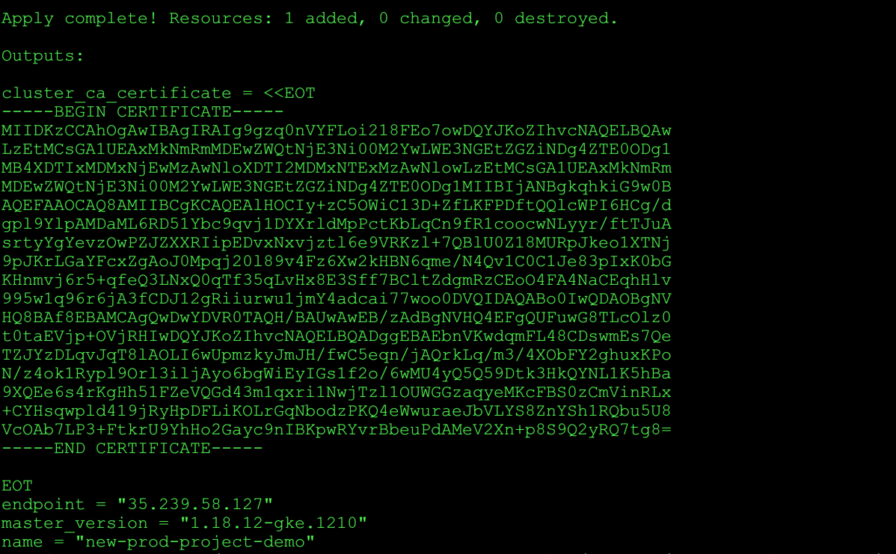

# Steps to setup kubernetes on GCP using terraform

Follow below steps to deploy kubernetes in GCP using terraform.

Step 1) Create service account **(in the new GCP project)** with admin access to Kubernetes, bigquery service and download the key in json format. After that activate the service account using following command:

```sh
gcloud auth activate-service-account --key-file=<path-to-service-account-key>
```

Step 2) `deploy.sh` shell script is used to update the `variable.tf` (for terraform) with the project-name and bigquery dataset name to store the k8s historic metrics.

Provide the two argument two `deploy.sh`, first argument (name of kubernetes cluster) should be the name of customer **(replace new-prod-project-demo)** and has to be unique in the GCP project. And second argument also should be unique in the GCP project and replace **bg_dataset_ks** with the name of bigquery dataset used for kubernetes logging and monitoring.

```sh
./deploy.sh new-prod-project-demo bg_dataset_ks
```

Step 3) Download terraform version 0.14.0 from the link <https://releases.hashicorp.com/terraform/0.14.0/terraform_0.14.0_linux_amd64.zip>

```sh
terraform init  # Initialize the plugins 
terraform plan  # To see the resources it will create on GCP
terraform apply # To deploy the K8S resources on GCP
```

Step 4) Once the `terraform apply` finishes, we got the following output which contains cluster_ca_certificate, kubernetes endpoint ip address, kubernetes version and name of the cluster.


Step 5) Copy the above generated certificate in file for example cert and then use base64 command to get encoded value.Use encoded certificate value, ip address to generate kubernetes config as mentioned in the below sample file `kubeconfig`:

```sh
cat cert |base64
```

Sample kubeconfig 

```sh
apiVersion: v1
clusters:
- cluster:
    certificate-authority-data: "LS0tLS1CRUdJTiBDRVJUSUZJQ0FURS0tLS0tCk1JSURLekNDQWhPZ0F3SUJBZ0lSQUlnOWd6xaGtpRzl3MEIKQVFFRkFBT0NBUThBTUlJQkNnS0NBUUVBbEhPQ0l5K3pDNU9XaUMxM0VCQUViblZLd2RxbUZMNDhDRHN3bUVzN1FlClRaSll6RExxdkpxVDhsQU9MSTZ3VXBtemt5Sm1KSC9md0M1ZXFuL2pBUXJrTHEvbTMvNFhPYkZZMmdodXhLUG8KTi96NG9rMVJ5cGw5T3JsM2lsakF5bzZiZ1dpRXlJR3MxZjJvLzZ3TVU0eVE1UTU5RHRrM0hrUVlOTDFLNWhCYQo5WFFFZTZzNHJLZ0hoNTFGWmVWUUdkNDNtMXF4cmkxTndqVHpsMU9VV0dHemFxeWVNS2NGQlMwekNtVmluUkx4CitDWUhzcXdwbGQ0MTlqUnlIcERGTGlLT0xyR3FOYm9kelBLUTRlV3d1cmFlSmJWTFlTOFpuWVNoMVJRYnU1VTgKVmNPQWI3TFAzK0Z0a3JVOVloSG8yR2F5YzluSUJLcHdSWXZyQmJldVBkQU1lVjJYbitwOFM5UTJ5UlE3dGc4PQotLS0tLUVORCBDRVJUSUZJQ0FURS0tLS0tCg=="
    server: "https://31.23.51.12"
  name: cluster-1
contexts:
- context:
    cluster: cluster-1
    user: user-1
  name: my-cluster
current-context: my-cluster
kind: Config
preferences: {}
users:
- name: user-1
  user:
    auth-provider:
      config:
      name: gcp
```

**Note:** In case terraform apply fails with below the below error , rerun the `terraform apply` command

```sh
Error: error creating NodePool: googleapi: Error 404: Not found:
```

